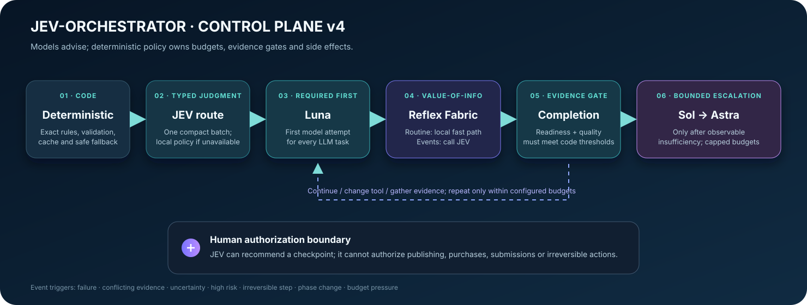
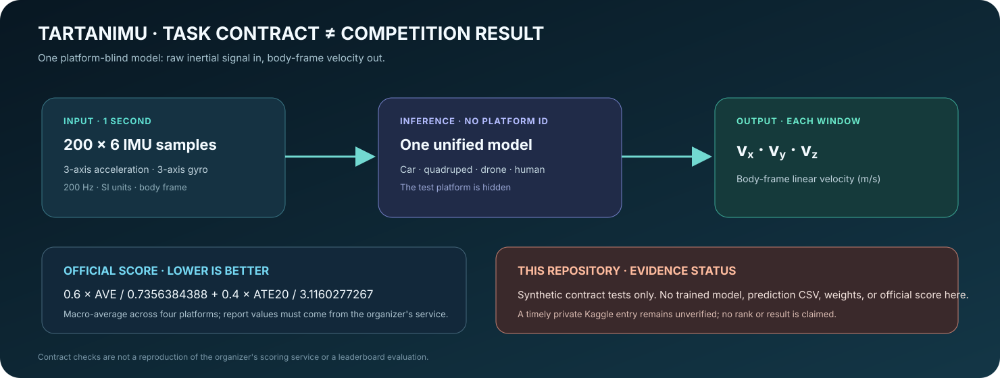

# JEV Orchestrator

**A bounded, deterministic-first control plane for cognitive workflows.** JEV makes typed routing and supervision decisions; application code owns budgets, validation, execution, privacy boundaries, and authorization.

[Leer en español](README.es.md) · [Architecture](docs/ARCHITECTURE.md) · [JEV operating policy](docs/JEV-POLICY.md) · [Security](docs/SECURITY.md) · [Release notes](docs/releases/v4.0.0.md)


> **v4.0.0 · Python 3.11+ · MIT**
>
> Windows-first reference implementation. Previous curated snapshots remain in [`versions/`](versions/).

## Why this project

Multi-model workflows can spend too much, repeat unchanged checks, escalate without evidence, or let a model recommendation act like permission. JEV Orchestrator separates semantic judgment from deterministic enforcement:

- deterministic short-circuits handle supported work without a model;
- one typed JEV request can choose a bounded route and success criteria;
- Luna is the first generative tier, with Sol and Astra available only after evidence of insufficiency;
- application-enforced per-run limits bound model calls, escalation, observed token usage, and JEV checkpoints;
- optional independent views are bounded and advisory, not a majority-vote substitute;
- telemetry omits free-form task/result content and redacts common secret patterns.



This is an orchestration layer, not a new foundation model. JEV confidence/probability values are judgments, not calibrated guarantees. Token caps prevent starting optional calls after observed use reaches a threshold; they are not provider-side hard generation limits.

## Quick start

The supported packaged workflow targets Windows. Clone to a drive with room (for example, `E:\JEV-Orchestrator`) and use Python 3.11 or newer.

```powershell
py -3.11 -m venv .venv
.\.venv\Scripts\python.exe -m pip install --upgrade pip
.\.venv\Scripts\python.exe -m pip install -e ".[dev]"
.\.venv\Scripts\python.exe -m pytest --basetemp .pytest-local
```

Run a task or inspect the shared JEV connector:

```bat
run.bat "Summarize these local project requirements"
run.bat connect
run.bat connect --remote
run.bat route "Choose a bounded approach for this task"
run.bat thinktank "Compare two high-impact options" --risk high --uncertainty 0.8
```

Remote JEV decisions require a TypeSafe credential. On Windows, store it interactively in Credential Manager; the key is entered with hidden input and is never placed in a command argument or project file:

```powershell
.\.venv\Scripts\python.exe scripts\store_jev_credentials.py --profile profile-a
```

The interactive profile helper is Windows-specific. `connect` without `--remote` runs local diagnostics; `probe`/remote routing make provider requests and may use account quota. See [`docs/JEV-POLICY.md`](docs/JEV-POLICY.md) and [`docs/SECURITY.md`](docs/SECURITY.md) before configuring credentials.

If Windows Credential Manager already contains a credential under a custom
profile name, select that profile for the current PowerShell session without
copying or re-entering the secret:

```powershell
$env:TYPESAFE_PROFILE = "your-profile"
run.bat connect --remote
run.bat route "Choose a bounded approach for this task"
```

The default profile is `profile-a`; the selected name must match the credential
target in Credential Manager. The profile name is not a credential.

## JEV policy at a glance

Use JEV when a semantic choice among a finite set of routes, a changed-state checkpoint, or a compact completion judgment can influence the next step. Prefer code for exact transformations, routine checks, budgets, and access control. Batch independent typed questions that use the same evidence; do not poll on an unchanged heartbeat.


The optional thinktank asks JEV whether extra independent views are worthwhile. v4 bounds those views, records missing or failed evidence as unresolved, and keeps the panel advisory. Purchases, public releases, submissions, and other consequential external actions still need the applicable human authorization.

## TartanIMU challenge work: evidence, not a rank claim

This repository includes **synthetic-data contract utilities and tests** for IMU window shapes, grouped splits, leakage checks, and score-formula helpers. It does not contain the official challenge dataset, a trained competition model or weights, a full official evaluator, a valid prediction upload, or an organizer-issued score. No leaderboard rank or eligibility is claimed.



This public repository contains no Kaggle submission receipt, accepted entry ID, competition prediction CSV, or official score-service result. It makes no claim about any participant's submission status, rank, or eligibility. See the dated [evidence note](docs/TARTANIMU-STATUS-2026-09-23.md) and the organizer's [challenge page](https://superodometry.com/imuchallenge/) for the requirements. Do not treat synthetic tests or a locally calculated metric as an official result.

## Development

```powershell
.\.venv\Scripts\python.exe -m pytest -q --basetemp .pytest-local
.\.venv\Scripts\python.exe -m compileall -q jev_orchestrator competitions\tartanimu
```

The dedicated pytest-local directory keeps test scratch on the checkout's
drive instead of the system temporary directory. It is ignored by Git and
reserved for pytest; pytest clears it at the start of each run.

The test suite covers routing, bounded escalation, credential handling, telemetry minimization, and synthetic TartanIMU contracts. Benchmarks that call JEV or a model incur network/quota use and are separate from unit tests. Start with [`CONTRIBUTING.md`](CONTRIBUTING.md).

## Project map

- `jev_orchestrator/` — current v4 runtime, router, supervision, policy, and telemetry.
- `competitions/tartanimu/` — synthetic contract helpers; not a trained submission.
- `docs/` — architecture, security, JEV usage policy, competition evidence, and release notes.
- `skills/typesafe-ai/` — project-local usage guidance for the TypeSafe SDK.
- `versions/v2.0.0/`, `versions/v3.0.0/` — preserved, curated historical snapshots; root v4 is the maintained version.
- `assets/` — generated cover image and three explanatory diagrams used above.

The cover illustration was generated with OpenAI image generation; the generation interface did not expose a model identifier. The diagrams are project documentation assets. Software and documentation are offered under the [MIT License](LICENSE); dependencies retain their own licenses.

## License

MIT. See [`LICENSE`](LICENSE).
