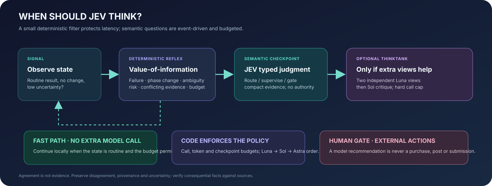

# JEV policy and operating guide

Use JEV as a typed semantic decision service, not as a worker that owns code or
authorization. Keep facts, deterministic transformations, file changes, and
budget enforcement in application code.



## When a JEV call is useful

- Initial selection among a finite set of worker roles or tools.
- Supervision after a meaningful state change, failure, ambiguity, conflict,
  budget threshold, or change of model tier.
- A completion decision based on a compact summary and explicit success
  criteria.
- A conditional independent-review plan when uncertainty or disagreement makes
  extra views valuable.

Prefer a deterministic fast path for exact transformations and stable routine
work. Do not poll JEV on a timer when nothing changed. Group independent typed
questions that use the same evidence into one request; split only when the first
answer is needed to acquire different evidence or construct the next question.

## Typed questions and uncertainty

The project uses `Choice` for closed-set routing, `Noul` for a yes/no judgment,
and `Score` for an ordered quality assessment. Choice probabilities and
confidence help characterize a model judgment; they are not calibrated
end-to-end correctness guarantees, and none of them grants permission to act.
Use the current official [TypeSafe documentation](https://docs.typesafe.ai/llms.txt)
and installed SDK types as the source of truth for API contracts.

## Escalation and human review

- Luna is the mandatory first generative attempt.
- Sol requires observable Luna insufficiency, such as a failed gate, a concrete
  failure, or unmet criteria.
- Astra requires an attempted but insufficient or failed Sol result.
- Code enforces call/token/checkpoint limits even when a model recommends more
  work.
- A `human_checkpoint` answer is advice only. Purchases, public releases,
  competition submissions, legal declarations, and irreversible operations need
  the user's authorization through the applicable workflow.

## Shared connector

The CLI wrappers call the repository's shared connector so agents use the same
profile resolution, retry behavior, and JSON contract:

```powershell
connect_jev.bat doctor
connect_jev.bat doctor --profile profile-a
connect_jev.bat probe --profile profile-a
run.bat route "Classify a bounded task"
run.bat thinktank "Compare two high-impact options" --risk high --uncertainty 0.8
```

`doctor` is local and does not call the provider; `probe` and typed decisions do.
`provenance: local` means no live JEV result was produced. A successful remote
probe verifies connectivity only, not the accuracy of every question.

For Windows Credential Manager, run
`python scripts/store_jev_credentials.py --profile profile-a` in an interactive
terminal and enter the key at the hidden prompt. The key is passed directly to
the vault and is never written to a project file. Environment variables are
supported for short-lived automation. Do not put a key in command-line
arguments, source files, task prompts, telemetry, or public examples.

If a key is already stored under a custom Credential Manager profile, select
that target for the current PowerShell session with
`$env:TYPESAFE_PROFILE = "your-profile"`. This lets `run.bat connect --remote`
and the router use the existing profile without duplicating the credential.
The default profile remains `profile-a` when no profile is selected.

## Caching and telemetry

Decision caching is exact-state/policy keyed. Disable it when fresh evidence or
time-sensitive state matters. Telemetry counts usage and redacts or omits
content, but the local cache may contain the state used for a judgment; keep it
local and out of version control. Do not claim token savings without measured
before/after usage for comparable tasks.
